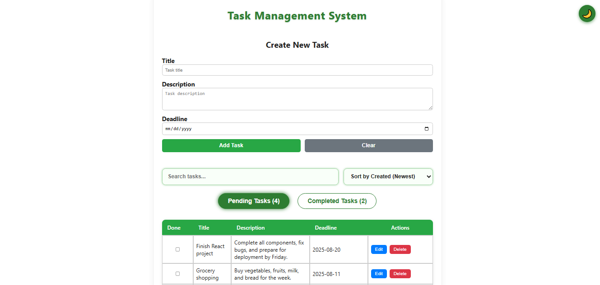

# 📋 Task Management System

## 📌 Overview
The **Task Management System** is a full-stack application designed to help you efficiently create, manage, and track your tasks.  
With a simple and intuitive interface, it supports task creation, updates, deletion, sorting, and completion tracking — all powered by **React**, **Node.js**, **Express**, and **MongoDB**.

---

## 🛠 How to Use the App
* **Add New Task** – Enter task details including title, description, and deadline.
* **View All Tasks** – See pending and completed tasks in organized lists.
* **Edit or Delete Tasks** – Update details or remove tasks easily.
* **Mark as Complete** – Click the ✅ button to finish a task, or revert it to pending.
* **Search & Sort** – Filter tasks by keywords and sort them by title or deadline.
* **Deadline Tracking** – Quickly see which tasks are due soon.

---

## 📚 Symbols
* ✅ **Completed Tasks** – Tasks that have been marked as done.
* ⏳ **Pending Tasks** – Tasks still in progress.
* ⚠️ **Deadline Approaching** – Tasks with deadlines nearing.

---

## ✨ Additional Features
* **Search Bar** – Quickly find tasks by title or description.
* **Sort Options** – Sort tasks by title or deadline in ascending/descending order.
* **Responsive UI** – Works on desktop, tablet, and mobile.
* **Tabs for Filtering** – Switch between Pending and Completed tasks with one click.

---

## 💡 Benefits
* **Stay Organized** – All your tasks in one place, clearly categorized.
* **Meet Deadlines** – Deadline alerts help you stay on track.
* **Easy to Use** – Minimal clicks to add, update, or complete a task.

---

## 💻 Tech Stack
* **Frontend:** React (Hooks, useState, useEffect)
* **Backend:** Node.js, Express.js
* **Database:** MongoDB with Mongoose
* **API Communication:** Fetch API
* **Styling:** Inline CSS (customizable)

---

## 🌐 Live Demo

---

## 👩‍💻 Author
**Safeeya Munawwar**  

  
  
  
  

---

© 2025 Task Management System | Built with ❤️ using React, Node.js, Express & MongoDB
